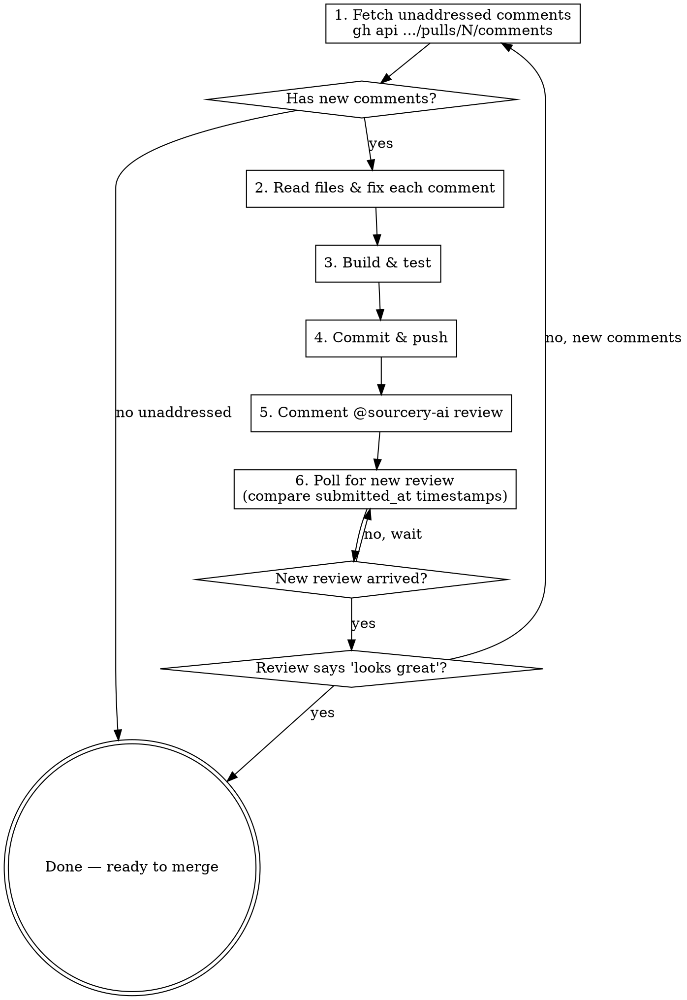

# Sourcery Review Loop

Iteratively address Sourcery AI review comments on a GitHub PR until approval.

## Workflow



## Key Commands

### Fetch Sourcery comments on a PR

```bash
# All Sourcery inline comments
gh api repos/OWNER/REPO/pulls/N/comments \
  --jq '.[] | select(.user.login | test("sourcery")) | {id, path, line, body, created_at}'

# Latest Sourcery review summary & state
gh api repos/OWNER/REPO/pulls/N/reviews \
  --jq '[.[] | select(.user.login | test("sourcery"))] | sort_by(.submitted_at) | last | {submitted_at, state, body}'
```

### Identify NEW comments (after a known timestamp)

```bash
# Count comments newer than last known review
gh api repos/OWNER/REPO/pulls/N/comments \
  --jq '[.[] | select(.user.login == "sourcery-ai[bot]" and .created_at > "TIMESTAMP")] | length'
```

### Trigger Sourcery review

```bash
gh pr comment N --body "@sourcery-ai review"
```

### Poll for new review

Compare `submitted_at` of the latest Sourcery review against the last known timestamp. When it changes, a new review has arrived.

## Addressing Comments

1. **Triage**: Skip comments already marked `Addressed in <sha>` — Sourcery auto-marks these
2. **Group by file**: Fix all comments in one file before moving to the next
3. **Build & test** after all fixes: `npm run build && npm test` (or project equivalent)
4. **Commit message pattern**: `fix: address PR #N round M review comments`

## Automating the Poll

Use `/loop` to set up recurring polling:

```
/loop 1m check sourcery for new comments, address them, push, re-trigger review
```

Stop the loop (`CronDelete <job-id>`) once Sourcery approves with no new inline comments.

## Knowing When You're Done

Sourcery approval looks like this in the review body:

> "I've reviewed your changes and they look great!"

Combined with **zero new inline comments** after the latest push. Both conditions must be true.

## Common Pitfalls

| Pitfall | Fix |
|---------|-----|
| Old comments without "Addressed" marker | Check if the code already has the fix — don't re-fix |
| Sourcery review doesn't arrive | Re-trigger with another `@sourcery-ai review` comment |
| `user.login` filter fails with `test("sourcery")` on string | Use `== "sourcery-ai[bot]"` for exact match, or ensure jq handles the type |
| Pushing without building first | Always `build && test` before commit |
